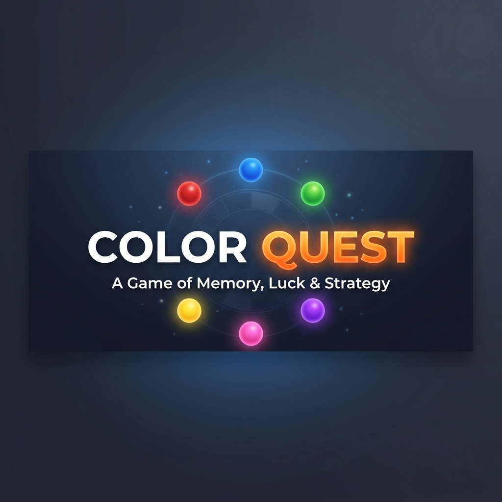
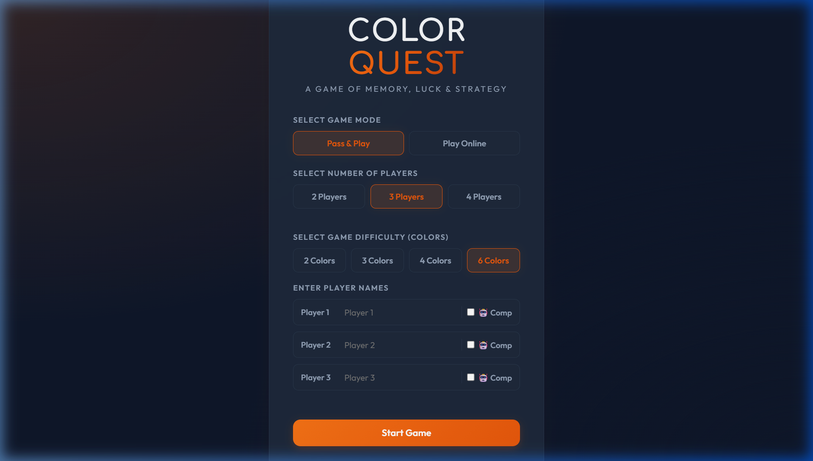
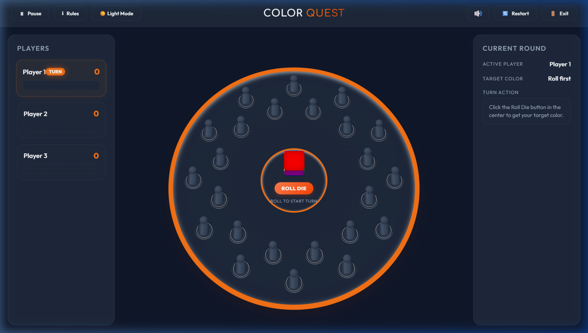

<p align="center">
  
</p>

<h1 align="center">🎲 Color Quest</h1>

<p align="center">
  <strong>A Multiplayer Memory &amp; Luck Board Game</strong><br/>
  <em>Roll the die · Reveal hidden colors · Collect the most pawns to win!</em>
</p>

<p align="center">
  
  
  
  
  
  
</p>

<p align="center">
  
  
  
</p>

---

## 📸 Screenshots

<p align="center">
  
  <br/>
  <em>🏠 Main Menu — Choose mode, players, difficulty, and custom names</em>
</p>

<br/>

<p align="center">
  
  <br/>
  <em>🎮 Gameplay — Circular board with 24 hidden pawns, 3D color die, and live scoreboard</em>
</p>

---

## 🎯 About

**Color Quest** is a digital adaptation of a classic circular memory and luck board game. Players take turns rolling a color die and then selecting pawns from the board, trying to match hidden colors. The game combines **memory**, **luck**, and **strategy** — remember where colors were revealed to gain an edge!

> 🧠 **Memory** — Remember revealed pawn colors from previous turns  
> 🍀 **Luck** — Roll the die and hope for a favorable color  
> 🧩 **Strategy** — Use your memory to pick the right pawn  

---

## ✨ Features

| Feature | Description |
|---------|-------------|
| 🎮 **Local Multiplayer** | Pass & Play mode for 2–4 players on the same device |
| 🌐 **Online Multiplayer** | Real-time peer-to-peer gameplay via WebRTC (PeerJS) |
| 🤖 **AI Opponents** | Add computer players with memory-based AI |
| 🎲 **3D Color Die** | Fully animated CSS 3D die with realistic rolling physics |
| 🔵 **Circular Board** | 24 pawns arranged in a beautiful circular layout |
| 🎨 **Adjustable Difficulty** | Choose 2, 3, 4, or 6 colors to control game complexity |
| 🔊 **Synthesized Audio** | Web Audio API-powered sound effects (match, mismatch, victory, turn change) |
| 💾 **Auto-Save** | Game progress is automatically saved to localStorage |
| 🌗 **Dark / Light Theme** | Toggle between elegant dark and clean light modes |
| 🏆 **Victory Screen** | Animated leaderboard with confetti particle effects |
| 📱 **Responsive Design** | Works on desktop, tablet, and mobile with adaptive layout |
| 🎯 **Particle Effects** | Match celebrations and victory confetti showers |

---

## 📜 How to Play

```
┌─────────────────────────────────────────────────────────┐
│                     GAME RULES                          │
├──────┬──────────────────────────────────────────────────┤
│  1️⃣  │  24 pawns of hidden colors are shuffled and     │
│      │  placed randomly on the circular board.          │
├──────┼──────────────────────────────────────────────────┤
│  2️⃣  │  On your turn, click "Roll Die" to get a       │
│      │  random target color.                            │
├──────┼──────────────────────────────────────────────────┤
│  3️⃣  │  Select any pawn on the board to reveal its    │
│      │  hidden color underneath.                        │
├──────┼──────────────────────────────────────────────────┤
│  4️⃣  │  ✅ MATCH → Collect the pawn (+1 point) and    │
│      │     get an EXTRA TURN!                           │
├──────┼──────────────────────────────────────────────────┤
│  5️⃣  │  ❌ MISMATCH → The pawn is briefly revealed,   │
│      │     then hidden again. Remember its color!       │
│      │     Turn passes to the next player.              │
├──────┼──────────────────────────────────────────────────┤
│  6️⃣  │  🏆 When all 24 pawns are collected, the       │
│      │     player with the most points wins!            │
└──────┴──────────────────────────────────────────────────┘
```

> **💡 Pro Tip:** Pay attention when other players reveal pawns — memorizing colors gives you a massive advantage on future turns!

---

## 🚀 Getting Started

### Prerequisites

- [Node.js](https://nodejs.org/) (v16 or higher)
- npm (comes with Node.js)

### Installation

```bash
# Clone the repository
git clone https://github.com/Darshan455111/Color-Quest.git

# Navigate to the project
cd Color-Quest

# Install dependencies
npm install

# Start the development server
npm run dev
```

The game will be available at `http://localhost:5173/` (or the next available port).

### Build for Production

```bash
npm run build
npm run preview
```

---

## 🏗️ Project Structure

```
Color-Quest/
├── 📄 index.html              # Main HTML with all screens & modals
├── 🎨 style.css               # Complete styling (dark/light themes, responsive)
├── 📁 js/
│   ├── 🎮 game.js             # Core game logic, turns, match/mismatch, AI
│   ├── 🖼️ ui.js               # UI manager, DOM rendering, event binding
│   ├── 🎲 die.js              # 3D CSS die animation and rolling
│   ├── ♟️ pawn.js              # Pawn component with lift/lower animations
│   ├── 🔵 board.js            # Circular board with 24 holes
│   ├── 🔊 audio.js            # Web Audio API synthesized sound effects
│   └── 🌐 network.js          # PeerJS WebRTC online multiplayer
├── 📁 screenshots/
│   ├── 🖼️ banner.png          # README banner
│   ├── 🖼️ main_menu.png       # Main menu screenshot
│   └── 🖼️ gameplay.png        # Gameplay screenshot
├── 📦 package.json            # Project metadata & scripts
└── 📄 README.md               # This file
```

---

## 🛠️ Tech Stack

<table>
  <tr>
    <td align="center" width="120">
      <br/>
      <strong>HTML5</strong><br/>
      <sub>Structure & Semantics</sub>
    </td>
    <td align="center" width="120">
      <br/>
      <strong>CSS3</strong><br/>
      <sub>Styling & 3D Transforms</sub>
    </td>
    <td align="center" width="120">
      <br/>
      <strong>JavaScript</strong><br/>
      <sub>Game Logic & DOM</sub>
    </td>
    <td align="center" width="120">
      <br/>
      <strong>Vite</strong><br/>
      <sub>Dev Server & Bundler</sub>
    </td>
  </tr>
  <tr>
    <td align="center" width="120">
      <strong>🔊</strong><br/>
      <strong>Web Audio</strong><br/>
      <sub>Synthesized SFX</sub>
    </td>
    <td align="center" width="120">
      <strong>🌐</strong><br/>
      <strong>PeerJS</strong><br/>
      <sub>WebRTC P2P</sub>
    </td>
    <td align="center" width="120">
      <strong>🎨</strong><br/>
      <strong>CSS 3D</strong><br/>
      <sub>Die Animations</sub>
    </td>
    <td align="center" width="120">
      <strong>💾</strong><br/>
      <strong>localStorage</strong><br/>
      <sub>Auto-Save State</sub>
    </td>
  </tr>
</table>

---

## 🎨 Game Modes

### 🏠 Pass & Play (Local)
Play on a single device by passing it between players. Supports **2–4 players** with customizable names and optional AI opponents.

### 🌐 Play Online
One player creates a room and shares a **4-digit code**. The other player joins using that code. Real-time gameplay is powered by **WebRTC** peer-to-peer connections via PeerJS — no server needed!

### 🤖 VS Computer
Toggle any player slot to **"Comp"** to add an AI opponent. The AI has limited memory and will remember recently revealed pawn colors to make strategic picks.

---

## 🎛️ Difficulty Levels

| Colors | Pawns per Color | Difficulty |
|--------|----------------|------------|
| 2 Colors | 12 each | 🟢 Easy |
| 3 Colors | 8 each | 🟡 Medium |
| 4 Colors | 6 each | 🟠 Hard |
| 6 Colors | 4 each | 🔴 Expert |

More colors = harder to remember = more strategy required!

---

## 🌗 Themes

Color Quest features a beautiful **dual-theme** system:

- **🌙 Dark Mode** — Sleek dark navy with glowing orange accents and glassmorphism panels
- **☀️ Light Mode** — Clean bright design with warm highlights

Theme preference is saved to localStorage and persists between sessions.

---

## 📱 Responsive Design

The game adapts to all screen sizes:

- **Desktop** — Full three-column layout with sidebars
- **Tablet** — Compact layout with collapsible panels  
- **Mobile** — Draggable floating HUD buttons for quick access to player list and game status

---

## 🤝 Contributing

Contributions are welcome! Feel free to:

1. 🍴 Fork the repository
2. 🌿 Create a feature branch (`git checkout -b feature/amazing-feature`)
3. 💾 Commit your changes (`git commit -m 'Add amazing feature'`)
4. 📤 Push to the branch (`git push origin feature/amazing-feature`)
5. 🔃 Open a Pull Request

---

## 📄 License

This project is licensed under the **ISC License** — see the [package.json](package.json) for details.

---

<p align="center">
  <strong>Made with ❤️ and JavaScript</strong><br/>
  <em>Roll the die. Trust your memory. Claim victory.</em>
</p>

<p align="center">
  <a href="#-color-quest">⬆️ Back to Top</a>
</p>
